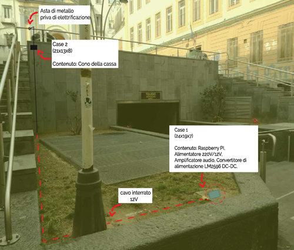

Conduzione Ossea
---

> #CUOREDINAPOLI Beyond The Lab - Tanti eroi, un unico battito


[](https://youtu.be/uzFeKjJlXVc)

## Concept
Il WebFaro è anima fisica e luminosa del battito **#CUOREDINAPOLI**; è un frammento di scultura, un dispositivo estetico e poetico, partecipativo e relazionale, con un cuore digitale e un’anima collettiva.

Tanti eroi, un unico battito è un mini-evento durante il quale è stato proiettato il cortometraggio "I volti dei Quartieri Spagnoli" (visibile sulla piattaforma VIMEO) ed è stato installato e connesso il WebFaro, anima fisica e luminosa del battito **#CUOREDINAPOLI**, sul terrazzo della Fondazione Foqus, visibile da Piazza Montecalvario.

Attraverso la conduzione ossea è stato posibile estendere il battito anche attraverso una ringhiera. 

## Installazione



Per l'installazione è necessario un dispositivo capace di eseguire NodeJS.

Dopo aver installato NodeJS, scaricabile al seguente indirizzo: <https://nodejs.org/it/download/>, occorre installare tutte le dipendenze eseguendo il comando
```
npm install
```

## Esecuzione 

Quando hai soddisfatto tutti i passi elencati nel paragrafo dedicato all'installazione puoi eseguirlo usando il seguente comando: 
```
node index.js
```
Tutto fatto, non ti resta che provarlo! 

## Links
- http://nuovetecnologiedellarte.it/
- https://cuoredinapoli.net
- https://nodejs.org


## License

### Code and images
MIT License: see [the `LICENSE` file] ().